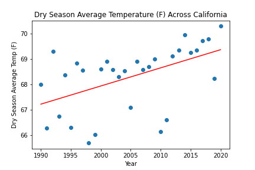
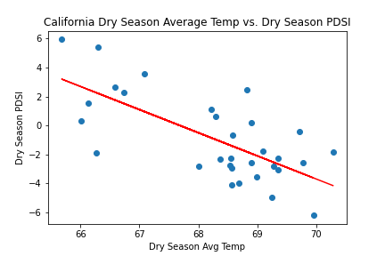
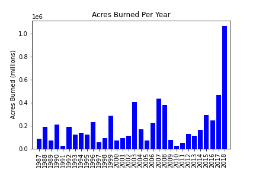
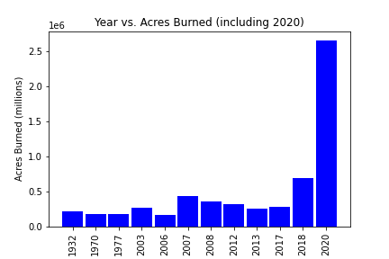

## California Wildfires and Climate Change      

**California wildfires have affected not only residents of California, but communities across the US. Many in California have been directly impacted by wildfires spreading through their communities, and others, both in California and other states, have experienced poor air quality due to particulate matter produced by the fires. We’re interested in condensing down the following topics and creating visuals that can be referenced by the general public to better understand the causes, effects, and risks of California wildfires. In doing so, we hope to be able to identify ways in which the general public can actively work to reduce wildfires in California.**   

> - Investigating the effects of climate change on wildfires in California. 
> - What is the effect of increasing California temperatures on wildfire severity and frequency?     
>> - We found that as average temperatures, particularly in the dry season continue to increase, California will see more drought. As there is increased drought, we predict that wildfire severity and frequency will increase.  
    
> - Have wildfires intensified in recent years? 
>> - We found that wildfire intensity has increased in the past five years, skewing our acres burned data to the right. 
  
> - Largest fires in California.
>> - We found that 9 of the 20 largest fires in California have happened in the past two years, and 2018 and 2020 were outliers in terms of acres burned. 
  
> - How can we reduce wildfires in California? 
>> - Activism and education not only for climate change but for wildfire awareness in California will be crucial to managing wildfire frequency and intensity. 

